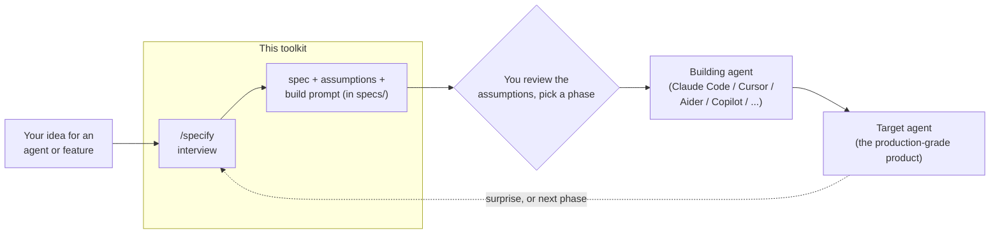

# Agent Specification Toolkit

[](LICENSE)
[](install.py)
[](https://claude.com/claude-code)

**Write specifications that AI coding agents can actually execute.** The toolkit uses **EARS**
(Easy Approach to Requirements Syntax) to turn vague preferences into verifiable contracts — the
load-bearing word `SHALL` makes a requirement something a test can check. It ships a guided
interviewer (`/specify`), a deterministic completeness linter, and printable reference cards.

A specification here is a **contract** the agent reads, fails against, then writes code to pass.
Here is what a requirements block looks like — real EARS, grouped by trigger:

```text
## requirements
### ubiquitous (always active)
- The system SHALL, for each column, report inferred type, fill rate, and distinct-value count.

### event-driven (WHEN — triggered by an action)
- WHEN the user supplies a valid CSV path, the system SHALL run the companion script and print a
  per-column Markdown table.

### unwanted behavior (IF — error handling)
- IF the path is missing or not a readable CSV, the system SHALL report the error and stop, with no
  partial output.

### optional feature (WHERE — behind a flag)
- WHERE the user requests it, the system SHALL add a one-line plain-English interpretation per column.
```

This block uses four of EARS' five patterns; the fifth — `WHILE` (state-driven) — is absent because
this run-once tool has no ongoing state to hold behaviour, and inventing a requirement just to show
the keyword would break the toolkit's own rule that every requirement be real. All five patterns are
catalogued on the [reference card](reference-cards/).

Every `SHALL` maps to a machine-checkable acceptance criterion, and `scripts/lint_spec.py` enforces
that the blocks are all present. The full worked example is in
[`examples/skill-csv-column-summariser/`](examples/skill-csv-column-summariser/specification.md).

## Three roles, one workflow

Three different "agents" are easy to confuse — keep them straight:

- **Target agent** — the agent, feature, or skill you're *specifying*; the thing to be built.
- **Building agent** — the AI coding tool that *reads the spec and writes the code*: e.g. Claude
  Code, Cursor, Aider, GitHub Copilot/Workspace, Windsurf.
- **The interviewer** — the `/specify` skill in this repo. It *produces the specification*; it does
  **not** build anything itself.



<!-- Regenerate docs/workflow.png after editing the diagram above / docs/workflow.mmd:
     npx @mermaid-js/mermaid-cli -i docs/workflow.mmd -o docs/workflow.png -b white -s 2 -->
<details>
<summary>Same diagram as a static image (for viewers where Mermaid does not render)</summary>


</details>

In short: **you + the interviewer write the spec → you review it → a building agent implements the
chosen phase → the target agent exists.** The spec stays the source of truth; you amend it or advance
a phase as the build proceeds (see [`interview/README.md`](interview/README.md)). For a **skill** or a
**declarative agent** (harness-run markdown), there is no separate build step — the interviewer emits
the `SKILL.md` / `AGENT.md` artifact directly, because "building" it is deterministic reformatting.

## Components

| Component | Status | What it is |
|-----------|--------|------------|
| **Reference cards** (`reference-cards/`) | ✅ ready | Printable US-Letter infographics — the at-a-glance method. |
| **Specification template** (`templates/`) | ✅ ready | Copy-paste skeleton you fill in, one file per agent, feature, or skill. |
| **Specification interviewer** (`/specify`) | ✅ ready | A Claude Code **skill** that runs a guided interview — helping and forcing you to supply every input a target needs — then writes a complete specification to `specs/`. For a build-required target it derives a phased build plan you choose from and emits a phase-scoped build prompt; for a zero-distance target (skill / declarative agent) it emits the `SKILL.md` / `AGENT.md` artifact directly. See `interview/README.md`. |
| **Examples** (`examples/`) | ✅ ready | Two worked `/specify` outputs — a zero-distance **skill** (spec + emitted `SKILL.md` + companion script) and a build-required **agent** (spec + a plan-gated build prompt). |

## Layout

```
.
├── .claude/skills/specify/
│   └── SKILL.md                                # the /specify interviewer (Claude Code skill)
├── reference-cards/
│   ├── agent-specification-field-guide.html   # editable source (fonts embedded — self-contained)
│   └── agent-specification-field-guide.pdf     # print-ready, 2 pages, US Letter
├── templates/
│   └── specification-template.md               # the copy-paste skeleton
├── interview/
│   └── README.md                               # how the interviewer works
├── examples/
│   ├── skill-csv-column-summariser/            # zero-distance example: spec + emitted SKILL.md
│   └── agent-pr-triage/                        # build-required example: spec + build prompt
├── docs/
│   ├── workflow.mmd                            # Mermaid source for the workflow diagram
│   └── workflow.png                            # static PNG fallback (regenerate from the .mmd)
├── scripts/
│   ├── regenerate.py                           # re-render every card's PDF from its HTML
│   └── lint_spec.py                            # deterministic spec completeness linter (stdlib)
├── install.py                                  # opt-in global installer (stdlib, cross-platform)
├── uninstall.py                                # clean uninstaller (manifest-based; restores backups)
├── requirements.txt
└── CLAUDE.md                                    # context for Claude Code when you continue
```

## Use it now

> **Command note:** where commands say `python` / `pip`, that is the **Windows** form. On
> **macOS / Linux**, use `python3` / `pip3` instead. Forward slashes in paths work on all three OSes.

**Run the interviewer.** From the repo root, start Claude Code (the skill ships with the repo, so
cloning is enough):

```
claude
```

Then, at the Claude Code prompt, name what you're building:

```
/specify a background PR-triage agent
```

It interviews you one question at a time, won't let required blocks stay empty, surfaces every
assumption for your review, then helps you choose how far this first build goes. Omit the target and
it asks what you're specifying.

**Where your outputs land.** Everything is written into `specs/` in the repo: the specification
(`specs/<slug>.md`, which embeds the reviewed assumptions list) plus — depending on the target's
**build class** — either a phase-scoped **build prompt** (`specs/<slug>.build-prompt.md`) you hand to
a *building agent* (build-required targets; see *Three roles* above), or the emitted **artifact**
itself (`SKILL.md` / `AGENT.md`) for a zero-distance target (a skill or declarative agent), which
needs no separate build step.

**Print a card.** Open the PDF in `reference-cards/` and print at *Actual size / 100%* (not
"fit to page"), paper **Letter**, margins **None**.

**Write a specification by hand** (instead of the interviewer). Copy the template into your
project and fill it in, one file per agent (or a feature):

- **macOS / Linux:**
  ```bash
  cp templates/specification-template.md /your-project/specs/your-agent-or-feature.md
  ```
- **Windows (PowerShell):**
  ```powershell
  Copy-Item templates\specification-template.md C:\your-project\specs\your-agent-or-feature.md
  ```

**Check a specification.** Validate a filled-in spec's completeness — pure deterministic checks,
no AI or tokens:

```
python scripts/lint_spec.py specs/your-agent-or-feature.md
```

Fill every block top to bottom, then hand it to your agent using the prompt at the bottom of
the template (it lives in an HTML comment).

## Where to run `/specify` — dev-home vs use-site

This repo is the tool's **home** — where `/specify` is developed and shipped from. But the tool's
*job* is to spec things you build **elsewhere**, so for real work you run it **in the project where
the target belongs**, not in this repo. (Running it here is only for developing the tool, or a demo.)

- **Project-local (default):** run `claude` inside a clone of this repo — `/specify` is available
  there, zero global footprint, and outputs land in *this* clone's `specs/`. Good for trying it out.
- **Global (opt-in, `install.py`):** installs the skill into `~/.claude/skills/specify/` so `/specify`
  works in **every** project. Then you `cd` into your real project (say `AAA`), run `claude`, and use
  `/specify` there. The toolkit repo isn't needed at runtime — the install copied everything the
  skill needs. (If both a global and a project-local copy exist, running inside a project that has its
  own copy uses that one — most specific wins.)

**Where the outputs land: in the project you run it from — not this repo.** `/specify` writes under
`specs/` relative to your current project. So in `AAA` you get `AAA/specs/<slug>.md`, plus — by build
class:

- **build-required** (coded feature / agent): `AAA/specs/<slug>.build-prompt.md`. You hand that to a
  building agent working *in AAA*, and the code is built in AAA.
- **zero-distance** (skill / declarative agent): the artifact is emitted directly *in AAA* — a
  **canonical** copy at `AAA/specs/<slug>.emitted/` (version-controlled safety copy) **and** a **live**
  copy at `AAA/.claude/skills/<name>/` (or `.claude/agents/<name>.md`) so it works immediately. Both
  are recorded in the spec's `## emitted artifacts` section, and `/specify` reminds you to commit at
  that milestone.

The point of the global install is exactly this: spec, build prompt (or artifact), and the eventual
code all live **together in the target project** — no copying specs out of this repo.

## Get it on another machine (safe, contained, removable)

This repo drops onto any machine — yours or someone else's — **without touching anything global**.
By default the `/specify` interviewer ships *inside the repo's own `.claude/` folder*, which Claude
Code loads **only** when you run it from this folder: nothing is installed system-wide, and removing
it is just deleting the folder.

**Pick your OS below and copy its block top to bottom**; ignore the other two. Steps assume no prior
knowledge — skip any tool you already have. (Forward slashes in paths work on all three OSes.)

### Windows (PowerShell)

```powershell
# 1. Prerequisites (skip any you already have):
#    Claude Code -> install from https://claude.com/claude-code   (then check: claude --version)
winget install --id Git.Git          # Git  (then check: git --version)

# 2. Download (clone) and enter the repo:
git clone https://github.com/hmbseaotter/agent-specification-toolkit.git
cd agent-specification-toolkit

# 3. Start Claude Code, then type  /specify  at its prompt:
claude

# 4. (Optional) make /specify available in EVERY project on this machine:
python install.py                    # undo later with:  python uninstall.py

# 5. Remove the toolkit entirely — run from the folder that CONTAINS the clone:
Remove-Item -Recurse -Force agent-specification-toolkit
```

### macOS

```bash
# 1. Prerequisites (skip any you already have):
#    Claude Code -> install from https://claude.com/claude-code   (then check: claude --version)
brew install git                     # Git  (or run `git --version` to trigger Apple's CLT installer)

# 2. Download (clone) and enter the repo:
git clone https://github.com/hmbseaotter/agent-specification-toolkit.git
cd agent-specification-toolkit

# 3. Start Claude Code, then type  /specify  at its prompt:
claude

# 4. (Optional) make /specify available in EVERY project on this machine:
python3 install.py                   # undo later with:  python3 uninstall.py

# 5. Remove the toolkit entirely — run from the folder that CONTAINS the clone:
rm -rf agent-specification-toolkit
```

### Linux

```bash
# 1. Prerequisites (skip any you already have):
#    Claude Code -> install from https://claude.com/claude-code   (then check: claude --version)
sudo apt update && sudo apt install git     # Debian/Ubuntu   (Fedora: sudo dnf install git)

# 2. Download (clone) and enter the repo:
git clone https://github.com/hmbseaotter/agent-specification-toolkit.git
cd agent-specification-toolkit

# 3. Start Claude Code, then type  /specify  at its prompt:
claude

# 4. (Optional) make /specify available in EVERY project on this machine:
python3 install.py                   # undo later with:  python3 uninstall.py

# 5. Remove the toolkit entirely — run from the folder that CONTAINS the clone:
rm -rf agent-specification-toolkit
```

> **SSH instead of HTTPS?** If you have set up SSH keys with GitHub, swap the clone URL for
> `git@github.com:hmbseaotter/agent-specification-toolkit.git`. If that means nothing to you, the
> HTTPS command above needs no setup. (Note: while this repo is private, cloning requires access;
> the HTTPS clone works for everyone once it is public.)

### About the optional global install (step 4)

You only need step 4 to use `/specify` *outside* this repo — the project-local default never does.
`install.py` needs only **Python 3.8+** (standard library — no `pip install`). It writes **only**
under `~/.claude/skills/specify/`, never touches your settings or hooks, and if a skill already
exists at that name it is **backed up** (moved aside), never overwritten — recording a manifest so
removal is exact and reversible:

- `install.py --dry-run` — preview exactly what it would do, change nothing.
- `uninstall.py` — remove the install and restore any backup it made.
- `uninstall.py --keep-backup` — remove the install but leave the backup in place.

After a global install, `/specify` works in every project; after uninstall your `~/.claude` is left
as it was.

## Edit & regenerate the cards

Edit content in a card's `.html`, then regenerate its PDF one of two ways:

**A. Browser (no install).** Open the `.html` → Print → *Save as PDF* → paper Letter, margins
None, and enable **"Background graphics"** (browsers strip color backgrounds otherwise).

**B. Script (repeatable, renders all cards).** (`python` / `pip` shown; on macOS/Linux use
`python3` / `pip3`.)

```
pip install -r requirements.txt
python -m playwright install chromium
python scripts/regenerate.py
```

Card HTML embeds its fonts (JetBrains Mono + Space Grotesk) as base64, so every card renders
identically on any machine with no font installation.

## Naming note

This toolkit prefers the full word **specification** over the abbreviation "spec" in names and
filenames, since "spec" is ambiguous out of context. Inside the card's running prose, "spec"
is left as idiomatic shorthand where the surrounding context makes the meaning unambiguous.

## License

[MIT](LICENSE) © hmbseaotter.
